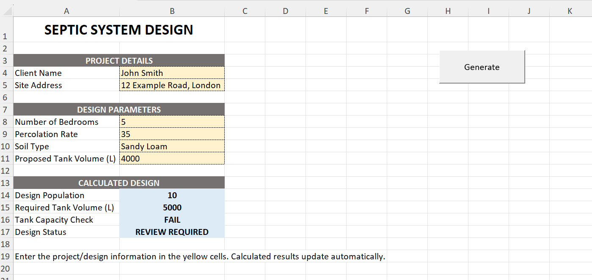
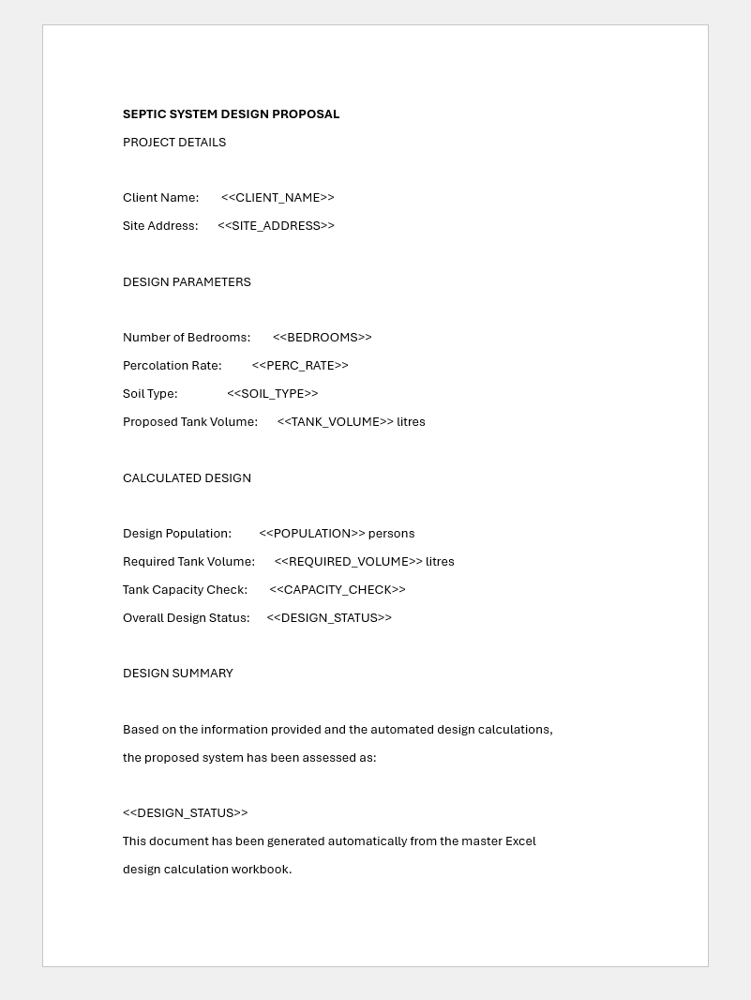

# Excel VBA → Word Proposal Automation

An automated Microsoft Office solution that uses **Excel as the calculation and data-entry engine** and **VBA to generate a professionally formatted Microsoft Word proposal**.

This project demonstrates how Excel VBA can connect multiple Office applications to transform a manual document-production process into a repeatable automated workflow.

---

## Project Overview

Many business processes involve entering information into Excel, performing calculations, and then manually copying the results into Word documents.

This project demonstrates how that entire workflow can be automated.

The user enters the required project information into a structured Excel interface. Excel performs the calculations and validation, and a VBA macro opens a Word template and automatically replaces predefined placeholders with the relevant Excel values.

The result is a populated Word proposal generated directly from Excel.

---

## Excel Input & Calculation Engine

The Excel workbook provides a structured interface for entering project information and automatically calculating the required outputs.



The demonstration workbook includes:

- Project and client information
- Design parameters
- Automated Excel calculations
- Capacity validation
- Design status checks
- Structured outputs ready for document generation

> **Note:** The engineering calculations used in this repository are demonstration values only and are not intended to represent regulatory or professional septic-system design standards.

---

## Automated Word Proposal

When the VBA automation is executed, Excel launches Microsoft Word, opens the proposal template and replaces the template placeholders with values from the Excel workbook.



Example placeholders include:

`<<CLIENT_NAME>>`

`<<SITE_ADDRESS>>`

`<<BEDROOMS>>`

`<<PERC_RATE>>`

`<<SOIL_TYPE>>`

`<<TANK_VOLUME>>`

`<<POPULATION>>`

`<<REQUIRED_VOLUME>>`

`<<CAPACITY_CHECK>>`

`<<DESIGN_STATUS>>`

This approach allows the Word document to retain professional formatting while Excel remains responsible for the underlying data and calculations.

---

## Automation Workflow

```text
User enters project data in Excel
              ↓
Excel performs calculations
              ↓
VBA validates and collects the results
              ↓
VBA launches Microsoft Word
              ↓
Word proposal template is opened
              ↓
Template placeholders are replaced
              ↓
Completed proposal is generated
```

---

## Key Features

- Excel-driven data entry
- Automated calculations
- VBA-controlled Word automation
- Dynamic placeholder replacement
- Excel-to-Word integration
- Data validation
- Automated proposal generation
- Error handling for missing Word templates
- Reusable document-generation architecture

---

## Technologies Used

| Technology | Purpose |
|---|---|
| Excel | Data entry and calculation engine |
| VBA | Automation and application control |
| Microsoft Word | Proposal/report generation |
| Word Templates | Professional document formatting |
| Excel Formulas | Calculations and validation |

---

## VBA Source Code

The core VBA automation is available here:

[`GenerateProposal.bas`](VBA/GenerateProposal.bas)

The VBA module:

1. Reads values from the Excel workbook.
2. Locates the Word proposal template.
3. Starts Microsoft Word using automation.
4. Opens the template.
5. Searches for predefined placeholders.
6. Replaces each placeholder with the corresponding Excel value.
7. Produces the populated proposal for the user.

The solution uses **late binding**, allowing Word automation without requiring a manually configured Microsoft Word object-library reference.

---

## Example Use Cases

The same architecture can be adapted for many business processes, including:

- Client proposals
- Quotations
- Engineering reports
- Project documentation
- Inspection reports
- Financial reports
- Compliance documents
- Customer letters
- Statements of work
- Automated management reports

The Excel workbook can act as the central calculation and data-processing engine while VBA generates consistently formatted Word documents.

---

## Repository Structure

```text
Excel-VBA-Word-Proposal-Automation/
│
├── VBA/
│   └── GenerateProposal.bas
│
├── Screenshots/
│   ├── Excel-Design-Input.png
│   └── Generated-Word-Proposal.png
│
└── README.md
```

---

## About

This project forms part of my **Excel VBA and Data Automation portfolio**.

I am a **Senior Data Analyst & Excel VBA Automation Engineer** with 19+ years of experience delivering data, reporting and automation solutions across enterprise environments.

My core areas include:

**Excel VBA · SQL · Data Migration · ETL · Data Validation · Data Analysis · Advanced Excel · Automation**

### Connect

[LinkedIn](https://www.linkedin.com/in/hasnaaddin) · [Portfolio](https://hasnaaddin.github.io/)
